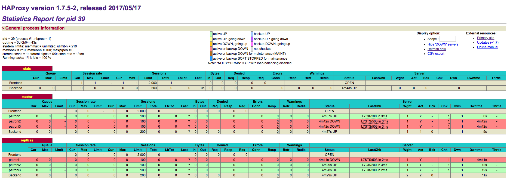
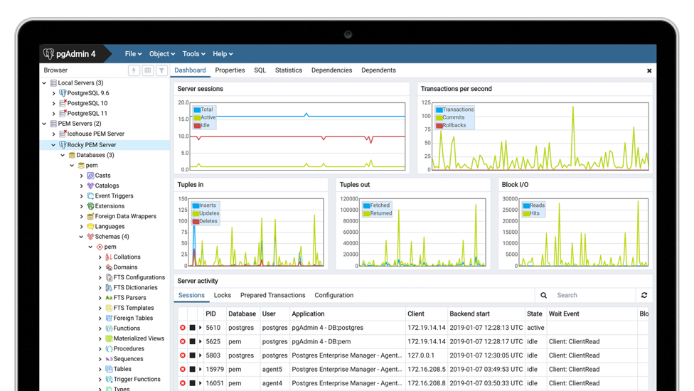

# PostgreSQL HA

Open source project [Patroni](https://github.com/zalando/patroni) is used in this PostgreSQL HA solution. It packs all necessary components in one image `patroni`,

- etcd
- pgbouncer
- confd
- haproxy
- patroni core

You can get one available image from DockerHub as `zer0one/patroni:v1.5.6`.

# How To Use

```bash
$ docker-compose -f docker-compose/docker-compose.yml -p ha up -d
```

By this, you will get a 3 instances etcd cluster, a 3 instance PostgreSQL cluster, a loadbalance (haproxy) run.

Then, you can access the PostgeSQL cluster via the loadbalancer on port `5432`.

If you want to check the status of each Patroni instances, access haproxy's status endpoint as: `http://localhost:8080/`. You will get:



# How To Test

You can use GUI tool [pgAdmin](https://www.pgadmin.org/) to test the PostgreSQL cluster. Stop/start patroni instances and try the service.


